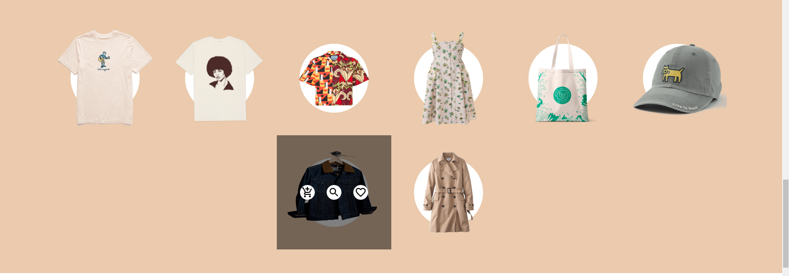

# MAGOSO E-COMMERCE
---
## Description
---
This is an official E-commerce website for Magoso Youth Centre where you can order a variety of different clothing and accessories worldwide. The delivery is done to you for free.
## Project link
---
- you can view life project [here](https://github.com/shikuku/e-commerce.git)
## Project screenshot
***



## Set up and Installation
---
To run this application on your computer do the following:
- Clone the project to your desired location using this command ```git clone https://github.com/shikuku/e-commerce.git```
- Navigate to the project directory using```cd e-commerce```
- open the project using favourite text editor eg in VScode use ```code .```
- install all the dependences using ```npm install```(to use npm you must have [Node](https://nodejs.org/en/) installed)
- run ```npm start```
## Technology used
---
- HTML5
- CSS3 
- JAVASCRIPT(EA6)
- REACT V17.0.2
- REACT DOM V17.0.2
- REACT ROUTER DOM V6.0.2
- REACT ROUTER V6.0.2
- NODE JS V16.13.0
- MATERIAL UI V5.1.0
## Known bugs
---
Make sure you down **LTS** version of Node
## LICENSE
---
- MIT License
Copyright (c) [2021] **STEPHEN MUASA SHIKUKU**

Permission is hereby granted, free of charge, to any person obtaining a copy
of this software and associated documentation files (the "Software"), to deal
in the Software without restriction, including without limitation the rights
to use, copy, modify, merge, publish, distribute, sublicense, and/or sell
copies of the Software, and to permit persons to whom the Software is
furnished to do so, subject to the following conditions:

The above copyright notice and this permission notice shall be included in all
copies or substantial portions of the Software.

THE SOFTWARE IS PROVIDED "AS IS", WITHOUT WARRANTY OF ANY KIND, EXPRESS OR
IMPLIED, INCLUDING BUT NOT LIMITED TO THE WARRANTIES OF MERCHANTABILITY,
FITNESS FOR A PARTICULAR PURPOSE AND NONINFRINGEMENT. IN NO EVENT SHALL THE
AUTHORS OR COPYRIGHT HOLDERS BE LIABLE FOR ANY CLAIM, DAMAGES OR OTHER
LIABILITY, WHETHER IN AN ACTION OF CONTRACT, TORT OR OTHERWISE, ARISING FROM,
OUT OF OR IN CONNECTION WITH THE SOFTWARE OR THE USE OR OTHER DEALINGS IN THE
SOFTWARE.
## Contact Information
***
- In case of bugs you can reach me on muasasteve@26gmail.com
## Author
---
***MUASA STEPHEN***
